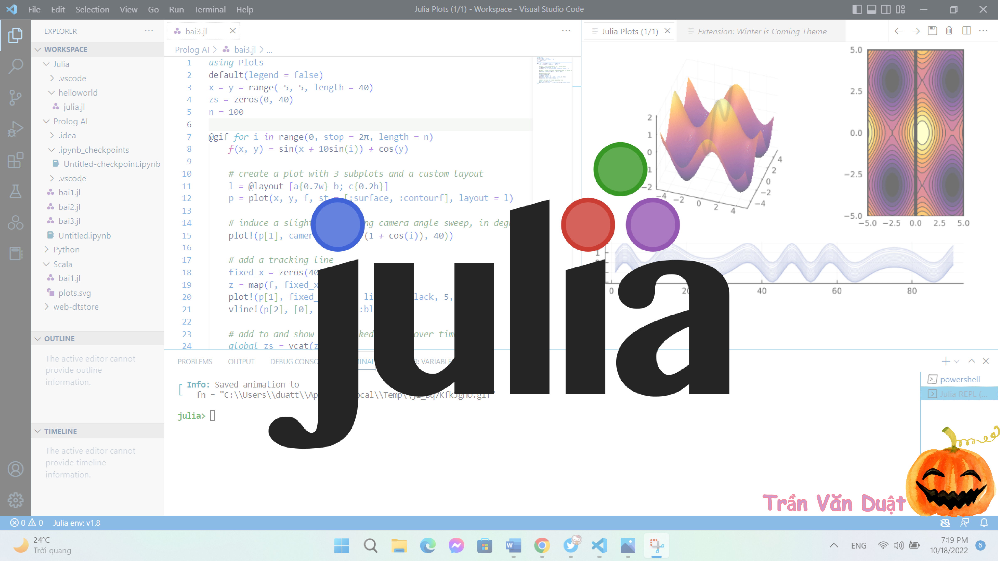

<h2 text-align="center">🛠 Technologies and Tools 🛠</h2>
 
<!-- https://simpleicons.org/ -->

&nbsp;

&nbsp;

&nbsp;

&nbsp;

&nbsp;

&nbsp;

&nbsp;

&nbsp;

&nbsp;

&nbsp;

&nbsp;

&nbsp;

&nbsp;

&nbsp;

&nbsp;

 
<h2 text-align="center">🔥 GitHub Stats 🔥</h2>
<!-- https://github.com/anuraghazra/github-readme-stats -->
 

  
  

 

 
<!-- https://icons8.com -->

  
  
  
  
  
  

 

<h2 text-align="center">📖 My MERN Stack Advanced Course 📖</h2>
 

  <a href="https://youtu.be/63opfUkPq6k" target="_blank">
    <strong>☕ Học lập trình MERN Stack Nâng Cao (NodeJS, ReactJS, ExpressJS, MongoDB)</strong>
  </a>

<strong>☕ Đây là một khóa học mà mình đã làm cực kỳ tâm huyết, với phong cách dạy lập trình làm dự án thực tế, chuyên nghiệp. Để các bạn có một hành trang kiến thức vững chắc cho hành trình sự nghiệp làm lập trình viên trong tương lai nhé.</strong>

<strong>☕ Vì mỗi lần mở lớp online dạy trực tiếp này mình chỉ nhận số lượng rất ít bạn để đảm bảo chất lượng học, nên là các bạn quan tâm thì cứ thoải mái liên hệ với mình sớm để đăng ký giữ chỗ cho những lớp tiếp theo nha!</strong>

  <strong>🔗 Link giới thiệu chi tiết: <a href="https://youtu.be/63opfUkPq6k" target="_blank">Lập Trình MERN Stack Nâng Cao - Học Thực Tế Để Đi Làm</a></strong>
   
  <strong>🔗 Liên hệ với mình tại Facebook: <a href="https://www.facebook.com/trungquandev" target="_blank">https://www.facebook.com/trungquandev</a></strong>
   
  <strong>📧 Hoặc Email: <a href="mailto:trungquandev.official@gmail.com" target="_top">trungquandev.official@gmail.com</a></strong>

 
<h2 text-align="center">📑 My Favorites Quote 📑</h2>
 

